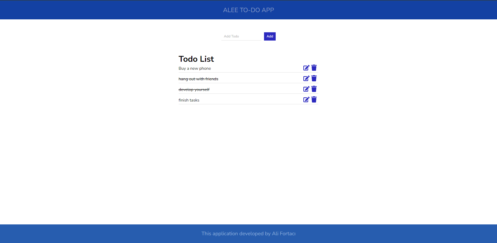
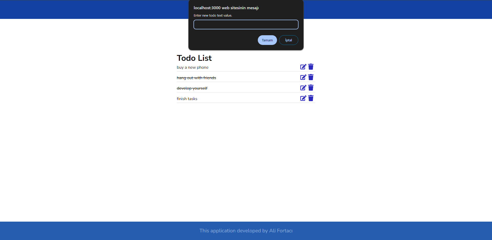

# Todo Uygulaması

Bu React uygulaması, basit bir todo listesi uygulamasıdır. Kullanıcılar yeni görevler ekleyebilir, var olan görevleri tamamlayabilir veya silebilirler. Ayrıca, her görevin üzerine tıklayarak düzenleme yapabilirler.

## Özellikler

- Yeni görev ekleme
- Görevleri tamamlama
- Tamamlanmış görevlerin üzerine çizgi çizilmesi
- Görevleri silme
- Görevleri düzenleme

## Kullanılan Teknolojiler

- React
- Redux Toolkit
- CSS

## Kurulum

1. Bu depoyu klonlayın:

```bash
git clone https://github.com/alifortacix/todo-app-react.git
```

2. Proje dizinine gidin:

```bash
cd todo-app-react
```

3. Bağımlılıkları yükleyin:

```bash
npm install
```

4. Uygulamayı başlatın:

```bash
npm start
```

## Ekran Görüntüleri





## Lisans

Bu proje MIT lisansı altında lisanslanmıştır. Daha fazla bilgi için [LICENSE](LICENSE) dosyasına bakın.

# Todo App

This is a simple todo list application built with React. Users can add new tasks, mark tasks as completed, delete tasks, and edit tasks by clicking on them.

## Features

- Add new tasks
- Mark tasks as completed
- Strikethrough effect for completed tasks
- Delete tasks
- Edit tasks

## Technologies Used

- React
- Redux Toolkit
- CSS

## Installation

1. Clone this repository:

```bash
git clone https://github.com/alifortacix/todo-app-react.git
```

2. Navigate to the project directory:

```bash
cd todo-app
```

3. Install dependencies:

```bash
npm install
```

4. Start the application:

```bash
npm start
```

## Screenshots


## License

This project is licensed under the MIT License. See the [LICENSE](LICENSE) file for details.

